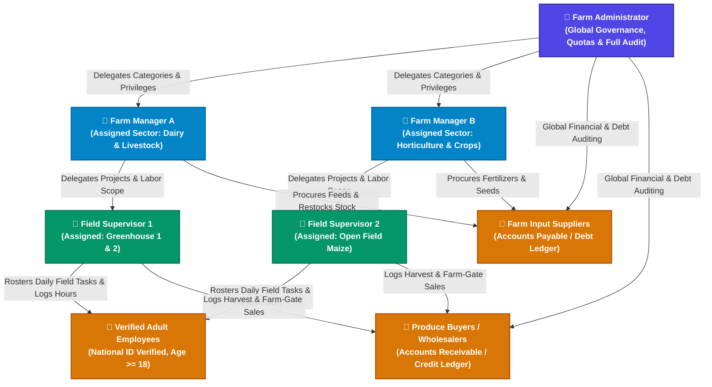
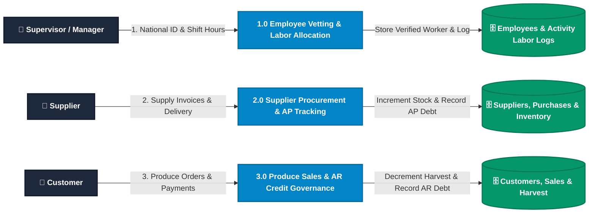
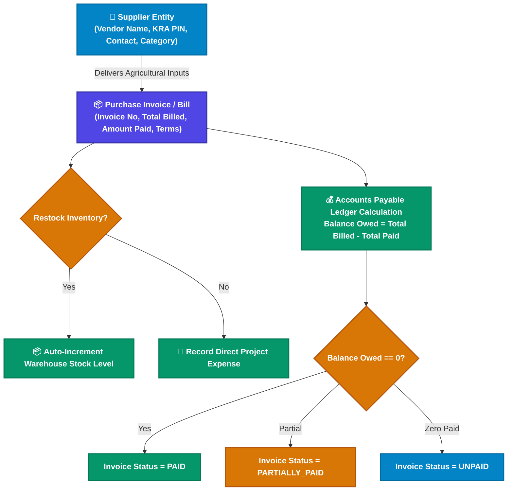
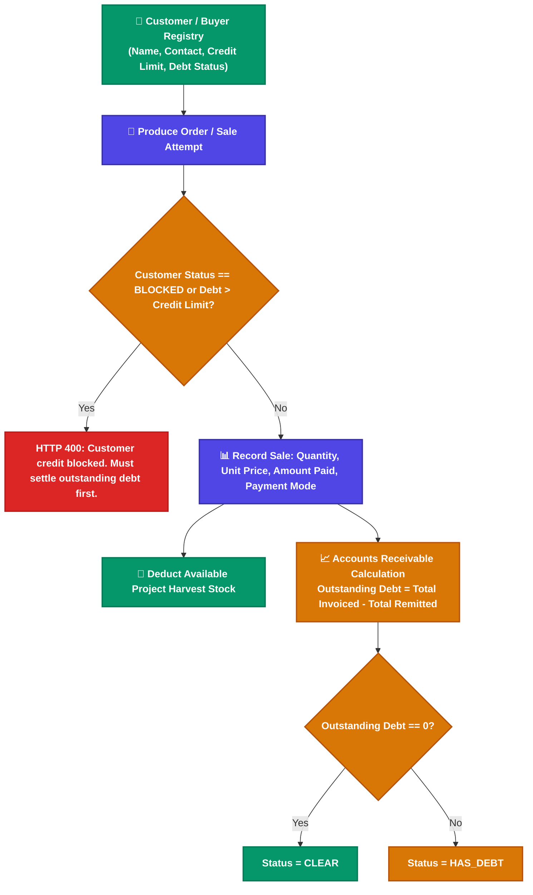

# Software Requirements Specification (SRS)
## SmartFarm Management Application

## 1. Introduction

### 1.1 Purpose
This Software Requirements Specification (SRS) document details the complete functional, non-functional, security, and architectural requirements for the **SmartFarm Management Application**. It serves as the authoritative single source of truth for engineering, compliance testing, and continuous maintenance.

### 1.2 Scope of the System
SmartFarm is an enterprise-grade cloud farm management platform designed for modern agricultural enterprises. The application enables:
- Executive governance, labor auditing, and financial/debt oversight by **Farm Administrators**.
- Sector-level resource management, project planning, supplier procurement, and supervisor delegation by **Farm Managers**.
- Field-level task coordination, harvest logging, input consumption, and verified laborer work assignment by **Field Supervisors** under strict financial privacy isolation.
- Comprehensive tracking of external trade relationships: **Suppliers (Accounts Payable / Farm Debt)** and **Customers (Accounts Receivable / Customer Credit)**.
- Strict national labor compliance ensuring legal adult workforce verification ($Age \ge 18$) and zero tolerance for child labor.

### 1.3 Definitions, Acronyms, and Abbreviations
- **RBAC:** Role-Based Access Control.
- **PBAC:** Privilege/Policy-Based Access Control (fine-grained feature toggle permissions).
- **Labor Compliance:** Strict validation of government National ID cards to guarantee legal adult employment eligibility ($Age \ge 18$) and eliminate child labor risks.
- **Accounts Payable (AP):** Cumulative financial liabilities owed by the farm to external input/feed/equipment suppliers.
- **Accounts Receivable (AR):** Cumulative credit balances owed to the farm by harvest and produce buyers.
- **Zero-State Dashboard:** A tailored, clean UI rendered when an authenticated user has zero assigned projects/categories, suppressing empty graphs and displaying actionable next steps.

---

## 2. Overall Description & System Context

### 2.1 System Architecture & Actor Hierarchy



### 2.2 System Actors & Responsibility Matrix

| Persona / Entity | System Scope | Max Quota | Core Responsibilities |
| :--- | :--- | :--- | :--- |
| **Farm Administrator** | Entire Farm (Global) | 1 Account | Global user provisioning, AP/AR debt auditing, category allocation, system governance, and database oversight. |
| **Farm Manager** | Assigned Categories | Max 2 Accounts | Project budgeting, supervisor provisioning, supplier procurement, labor auditing, and sector reporting. |
| **Field Supervisor** | Assigned Projects | Max 10 Accounts | Daily field activity execution, harvest logging, worker task allocation, stock usage, and farm-gate sales under financial privacy isolation. |
| **Employees / Laborers** | Assigned Tasks | Scalable Registry | Verified adult workforce ($Age \ge 18$, National ID required) executing field operations with automated wage calculations. |
| **Suppliers** | Farm Inputs Catalog | Scalable Directory | Vendors providing seed, fertilizer, animal feed, tools, and machinery on cash or invoice credit terms. |
| **Customers** | Produce Distribution | Scalable Directory | Wholesale/retail buyers purchasing farm yields on cash, M-Pesa, or credit ledger terms. |

---

## 3. Data Flow Diagram (DFD Level 1)



---

## 4. Detailed Functional Requirements (FR)

### FR-1: Authentication, Account Provisioning & Password Recovery
- **FR-1.1:** System shall support authentication using either `Username` or `Email` combined with a password.
- **FR-1.2:** Unauthenticated users can request a password reset by providing their registered email address (`POST /users/forgot-password`).
- **FR-1.3:** If an email is not registered in the system, the API shall return HTTP 400 with: *"No account found with this email address. If you did not register an email, please contact your Farm Administrator to reset your password."*
- **FR-1.4:** If the email exists, the system generates a secure cryptographic token (`PasswordResetToken` valid for 1 hour) and sends an HTML reset email via SMTP.
- **FR-1.5:** Administrators can execute direct password resets for staff accounts via the User Management portal (`PATCH /users/{id}/admin-reset-password`).

### FR-2: Staff Quotas & Hierarchical Access Delegation (PBAC)
- **FR-2.1:** The system shall strictly enforce staff limits: Max 1 Admin, Max 2 Managers, Max 10 Supervisors.
- **FR-2.2:** **Admin to Manager Delegation:**
  - Admin assigns one or more Farm Categories to a Manager.
  - Admin configures fine-grained privilege toggles for the Manager (`CAN_CREATE_CATEGORIES`, `CAN_CREATE_SUPERVISORS`, `CAN_VIEW_FINANCIALS`, `CAN_MANAGE_BUDGETS`, `CAN_DELETE_INVENTORY`).
- **FR-2.3:** **Manager to Supervisor Delegation:**
  - Manager provisions supervisors linked to their manager account ID (`manager_id`).
  - Manager assigns specific projects (within the Manager's categories) to the Supervisor.
  - Manager configures fine-grained privilege toggles for the Supervisor (`CAN_RECORD_HARVEST`, `CAN_LOG_ACTIVITIES`, `CAN_USE_INVENTORY`, `CAN_RECORD_EXPENSES`, `CAN_RECORD_SALES`).

### FR-3: Workload & Capacity Validation Rules
- **FR-3.1 (Manager Workload):** When assigning a category to a Manager, if assignments exceed 3 active categories, an advisory workload confirmation is triggered.
- **FR-3.2 (Supervisor Workload):** Each supervisor has a `max_project_capacity` (default 4 projects). The system blocks assigning additional active projects unless capacity is adjusted or existing projects complete.

### FR-4: Category & Project Lifecycle Management
- **FR-4.1:** Projects must belong to an existing Category and possess a globally unique project name.
- **FR-4.2 (Date Validation Rule):** The system shall strictly validate that `startDate <= endDate`. If `startDate > endDate`, both backend and frontend reject the request with: *"Start date cannot be greater than end date!"*
- **FR-4.3 (Budget Modification Rule):** Modifying project details, season, dates, or budgets strictly requires `CAN_MANAGE_BUDGETS` privilege.

### FR-5: Operational Field Tracking (Harvest, Activity, Inventory)
- **FR-5.1:** Harvest records capture item name, numerical yield, unit of measurement (KG, Litres, Bags, Crates), date, and notes.
- **FR-5.2:** Activities capture activity title, type (Weeding, Irrigation, Spraying, Feeding, Pruning), date, notes, and attached laborers.
- **FR-5.3:** Inventory tracks quantity in stock, unit prices, reorder levels, and records deduction history when consumed by projects.

### FR-6: Financial Governance & Sales Enforcement
- **FR-6.1 (Stock-Backed Sales Rule):** A project cannot record a sale exceeding its total recorded harvest yields minus previous sales.
- **FR-6.2 (Supervisor Financial Shield):** Supervisor API endpoints and dashboard views strip budget allocations, sales revenue, and profit calculations.

### FR-7: Dynamic Scoped Dashboards & Zero-State Engine
- **FR-7.1 (Admin Dashboard):** Renders enterprise-wide aggregates, category financial distribution, user quotas, and global cashflow.
- **FR-7.2 (Manager Dashboard):** Aggregates budget, project counts, and supervisor workloads strictly for the manager's assigned categories.
- **FR-7.3 (Supervisor Dashboard):** Aggregates harvest volumes, pending tasks, and recent logs strictly for assigned projects.
- **FR-7.4 (Zero-State Suppression):** If a user has 0 assigned categories or 0 assigned projects:
  - All metrics cards, financial figures, and graphs are **suppressed**.
  - Renders a dedicated **Action Hero Card** providing immediate contextual instructions (e.g., *"No categories assigned yet. Contact your Farm Administrator to get started."*).

### FR-8: User Deletion & Referential Integrity Safeguards
- **FR-8.1:** Admin accounts cannot be deleted (`isUserAdmin` protection).
- **FR-8.2:** Deleting a user safely cascades/unlinks child records: deletes active `PasswordResetToken` rows, clears category join tables, unlinks `supervisor_id` on projects, and clears `createdById` references.

---

### FR-9: Labor Compliance, Legal Adult Verification & Work Assignment

```mermaid
flowchart TD
    classDef startNode fill:#4f46e5,stroke:#3730a3,stroke-width:2px,color:#ffffff,font-weight:bold;
    classDef decisionNode fill:#d97706,stroke:#b45309,stroke-width:2px,color:#ffffff,font-weight:bold;
    classDef successNode fill:#059669,stroke:#047857,stroke-width:2px,color:#ffffff,font-weight:bold;
    classDef errorNode fill:#dc2626,stroke:#b91c1c,stroke-width:2px,color:#ffffff,font-weight:bold;
    classDef actionNode fill:#0284c7,stroke:#0369a1,stroke-width:2px,color:#ffffff;

    Start([Supervisor / Manager Rosters Labor]):::startNode --> CheckEmp{Worker registered in system?}:::decisionNode
    
    CheckEmp -- New Worker --> InputReg[Enter Full Name, Kenyan National ID, Phone, Daily Wage Rate, Employment Type]:::actionNode
    InputReg --> ValidateID{Valid Kenyan National ID (7-8 Digits) & Age >= 18?}:::decisionNode
    ValidateID -- Invalid / Minor --> RejectEmp[HTTP 400: Valid National ID required. Minors prohibited by labor compliance policy.]:::errorNode
    ValidateID -- Valid Adult --> CheckUnique{National ID already registered?}:::decisionNode
    CheckUnique -- Duplicate --> ErrDup[HTTP 400: Employee already registered with this National ID]:::errorNode
    CheckUnique -- Unique --> SaveEmp[Persist Employee with status = ACTIVE]:::successNode
    
    CheckEmp -- Existing Worker --> VerifyActive{Employee Status is ACTIVE?}:::decisionNode
    VerifyActive -- Inactive / Suspended --> ErrInactive[HTTP 400: Inactive employee cannot be assigned to activities]:::errorNode
    VerifyActive -- Active --> AttachTask[Attach Worker(s) to Project Activity Task]:::actionNode
    SaveEmp --> AttachTask
    
    AttachTask --> LogHours[Record Date, Hours Worked, Wage Rate, and Performance Notes]:::actionNode
    LogHours --> CalcWage[Calculate Wage Payable = hoursWorked * (dailyRate / 8)]:::actionNode
    CalcWage --> SaveActivity[Persist Labor Assignment & Activity Record]:::successNode
```

- **FR-9.1 (Adult Labor Verification):** All farm hands and field workers must be registered with their official government **National ID number**, **Full Name**, and **Phone Number** (for identification and M-Pesa payroll).
- **FR-9.2 (Minor Employment Prohibition):** System strictly blocks onboarding laborers without verified government identity credentials, preventing child labor compliance violations.
- **FR-9.3 (Employment Classification):** Supports `CASUAL` (daily wage / task-based) and `PERMANENT` (salaried / monthly) employee profiles.
- **FR-9.4 (Task & Activity Allocation):**
  - Admins, Managers, and Field Supervisors can assign one or more verified employees to any project activity (e.g., *Weeding Sector 1*, *Spraying Block C*, *Irrigation Line Setup*).
  - Captures: `activity_id`, `employee_id`, `date`, `hours_worked`, `daily_rate`, `wage_payable`, and supervisor remarks.
- **FR-9.5 (Labor Audit Trail & Payroll Summary):** Provides a complete historical log of all tasks performed by an employee across farm projects for labor auditing and wage settlements.

---

### FR-10: Supplier Management & Accounts Payable (Debt) Ledger



- **FR-10.1 (Supplier Registry):** Centralized directory of external farm suppliers capturing: `name`, `contact_person`, `phone_number`, `email`, `id_or_tax_number` (KRA PIN / National ID), `category_supplied` (*Fertilizer & Agro-chemicals*, *Animal Feeds*, *Seeds & Seedlings*, *Farm Machinery & Hardware*, *Veterinary Supplies*), and physical address.
- **FR-10.2 (Purchase & Expense Linkage):** When stock is added to inventory or project cash expenses are recorded, transactions can be linked directly to a registered `supplier_id`.
- **FR-10.3 (Accounts Payable / Debt Tracking):**
  - For each supplier transaction, captures: `invoice_number`, `invoice_amount`, `amount_paid`, `balance_due`, `payment_status` (`PAID`, `PARTIALLY_PAID`, `CREDIT_UNPAID`), and `payment_due_date`.
  - Calculates live supplier balances: $\text{Balance Owed} = \sum \text{Invoice Amount} - \sum \text{Amount Paid}$.
- **FR-10.4 (Executive Debt Governance):** Admin and authorized Managers have dedicated dashboard widgets tracking Total Farm Accounts Payable (Outstanding Debt Owed to Suppliers) with overdue liability alerts.

---

### FR-11: Customer Credit Governance & Accounts Receivable Ledger



- **FR-11.1 (Customer Registry Expansion):** Stores buyer identity including `name`, `contact`, `id_number`, `address`, `credit_limit`, and `credit_status` (`CLEAR`, `HAS_DEBT`, `CREDIT_BLOCKED`).
- **FR-11.2 (Credit Sales & Partial Payments):**
  - When recording sales, supports immediate full cash/M-Pesa payment, partial payment, or full credit terms.
  - Captures: `total_amount`, `amount_paid`, `balance_due` ($\text{total\_amount} - \text{amount\_paid}$), `payment_mode` (`CASH`, `MPESA`, `BANK_TRANSFER`, `CREDIT_LEDGER`), and `payment_status` (`PAID_IN_FULL`, `PARTIAL_PAYMENT`, `CREDIT_UNPAID`).
- **FR-11.3 (Accounts Receivable / Debtor Tracking):**
  - Automatically calculates customer debt balances: $\text{Outstanding Debt} = \sum \text{Total Invoiced} - \sum \text{Total Remitted}$.
  - Flags customers exceeding credit terms or with overdue balances during new sale attempts.
- **FR-11.4 (Supervisor Privacy Isolation):** Field Supervisors can log transaction-level cash/credit splits for direct farm-gate sales without gaining access to cumulative farm-wide debtor reports.

---

## 5. Non-Functional Requirements (NFR)

- **NFR-1 (Security):** BCrypt password hashing ($cost = 10$), role/privilege-based endpoint security, parameter sanitization, and SQL injection prevention via Spring Data JPA.
- **NFR-2 (Performance):** Page load times $< 1.5s$ on broadband; database indexed on `username`, `email`, `category_id`, `supervisor_id`, `manager_id`, `employee_id`, `supplier_id`, `customer_id`.
- **NFR-3 (Reliability):** 99.9% uptime target backed by automated heartbeat monitoring.
- **NFR-4 (Cost):** 100% compliant with zero-cost cloud architecture limits (Render Free Web Service, Vercel Hobby, TiDB Cloud / Aiven Free Tier).
- **NFR-5 (Usability):** Modern design system with responsive layouts, accessible color contrast, and dedicated mobile field data entry views.
