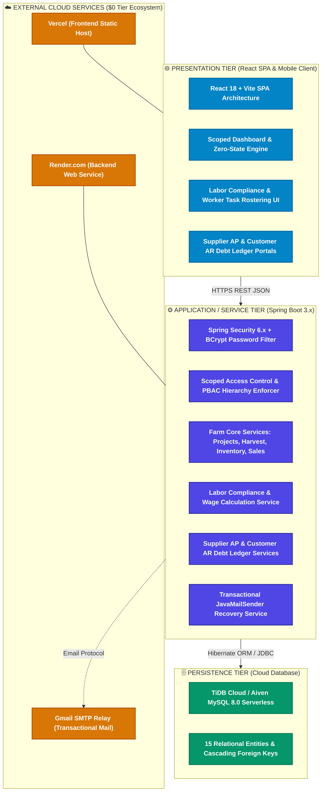
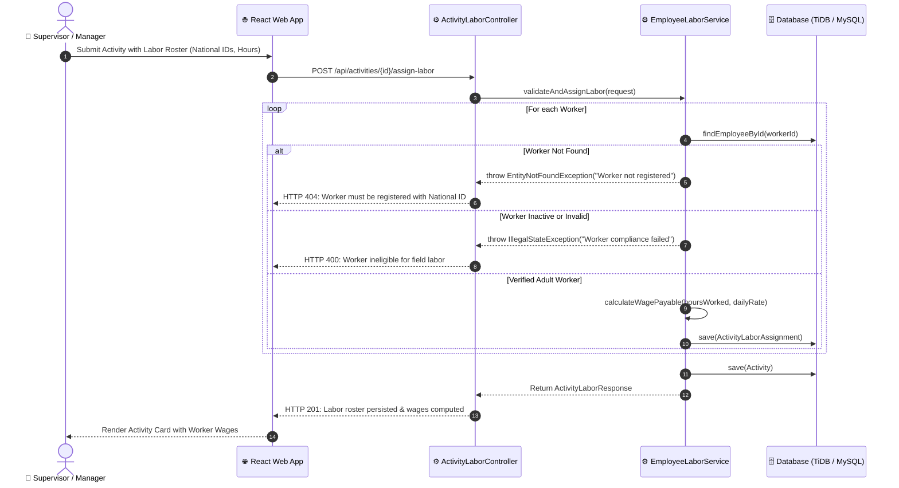
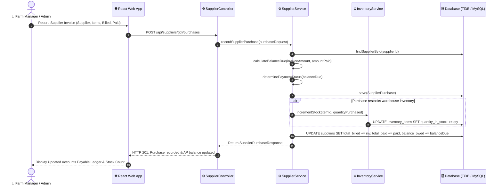
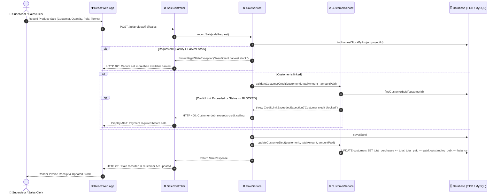

# System Design & Architecture Document (SDD)
## SmartFarm Management Application

## 1. Architectural Overview & Technology Stack

The SmartFarm system follows a **3-Tier Clean Architecture** separating presentation, business orchestration, and persistent storage:

---

## 2. Complete Entity-Relationship Model (ERD)

```mermaid
erDiagram
    USERS ||--o{ USERS : "manages (Manager -> Supervisors)"
    USERS ||--o{ USER_ASSIGNED_CATEGORIES : "assigned to"
    CATEGORIES ||--o{ USER_ASSIGNED_CATEGORIES : "contains"
    CATEGORIES ||--o{ PROJECTS : "groups"
    USERS ||--o{ PROJECTS : "supervises (1 Supervisor -> N Projects)"
    USERS ||--o{ PASSWORD_RESET_TOKENS : "owns"
    
    PROJECTS ||--o{ EXPENSES : "incurs"
    PROJECTS ||--o{ SALES : "generates"
    PROJECTS ||--o{ HARVESTS : "yields"
    PROJECTS ||--o{ ACTIVITIES : "tracks"
    
    ACTIVITIES ||--o{ ACTIVITY_LABOR_ASSIGNMENTS : "allocates"
    EMPLOYEES ||--o{ ACTIVITY_LABOR_ASSIGNMENTS : "performs"
    USERS ||--o{ EMPLOYEES : "registers"
    
    INVENTORY_ITEMS ||--o{ INVENTORY_USAGES : "consumed by"
    PROJECTS ||--o{ INVENTORY_USAGES : "uses stock in"
    
    SUPPLIERS ||--o{ SUPPLIER_PURCHASES : "invoices"
    INVENTORY_ITEMS ||--o{ SUPPLIER_PURCHASES : "restocks via"
    EXPENSES ||--o{ SUPPLIER_PURCHASES : "settles via"
    
    CUSTOMERS ||--o{ SALES : "buys from"

    USERS {
        string id PK "e.g. A001, M002, S003"
        string username UK
        string email UK
        string password "BCrypt Hash"
        string role "ADMIN | MANAGER | SUPERVISOR"
        string status "ACTIVE | PENDING_APPROVAL | DISABLED"
        string manager_id FK "References Parent Manager"
        string created_by_id
        int max_project_capacity "Default 4"
        string privileges_raw "Comma-separated privilege keys"
    }

    CATEGORIES {
        string id PK "e.g. C001, L002, P003"
        string name UK
        string description
    }

    PROJECTS {
        string id PK "e.g. D001, M002"
        string name UK
        string season
        string status "active | in_progress | completed"
        date start_date
        date end_date
        decimal budget
        string description
        string category_id FK
        string supervisor_id FK "Single assigned Supervisor (1:N)"
        string manager_id FK
    }

    EMPLOYEES {
        string id PK "e.g. EMP-001"
        string full_name "Full Legal Name"
        string id_number UK "Kenyan National ID (Adult Verification)"
        string phone_number "Contact & M-Pesa Payroll"
        string employment_type "CASUAL | PERMANENT"
        decimal daily_rate "Base Daily Wage"
        string status "ACTIVE | INACTIVE"
        string registered_by_id FK "References User who onboarded"
        timestamp created_at
    }

    ACTIVITIES {
        string id PK "e.g. ACT-001"
        string title "Task Title (e.g. Weeding)"
        string type "Weeding | Spraying | Irrigation | Feeding | Pruning"
        date performed_on
        string notes
        string project_id FK
    }

    ACTIVITY_LABOR_ASSIGNMENTS {
        bigint id PK
        string activity_id FK
        string employee_id FK
        date assignment_date
        float hours_worked
        decimal wage_payable
        string notes
    }

    SUPPLIERS {
        string id PK "e.g. SUP-001"
        string name UK "Company or Trader Name"
        string contact_person
        string phone_number
        string email
        string id_or_tax_number "KRA PIN / National ID"
        string category "Fertilizers | Feeds | Seeds | Tools | Veterinary"
        string address
        decimal total_billed "Sum of Invoices"
        decimal total_paid "Sum of Payments"
        decimal balance_owed "Accounts Payable (Total Billed - Total Paid)"
    }

    SUPPLIER_PURCHASES {
        string id PK "e.g. PUR-001"
        string supplier_id FK
        string inventory_item_id FK "Optional Restock Link"
        string expense_id FK "Optional Expense Link"
        string invoice_number
        decimal invoice_amount
        decimal amount_paid
        decimal balance_due "Invoice Amount - Amount Paid"
        string payment_status "PAID | PARTIAL | UNPAID"
        date purchase_date
        date due_date
        string notes
    }

    CUSTOMERS {
        string id PK "e.g. CUST-001"
        string name
        string contact UK
        string id_number
        string address
        decimal credit_limit
        decimal total_purchases "Sum of Sales Invoices"
        decimal total_paid "Sum of Remittances"
        decimal outstanding_debt "Accounts Receivable (Purchases - Paid)"
        string credit_status "CLEAR | HAS_DEBT | BLOCKED"
    }

    SALES {
        string id PK "e.g. SAL-001"
        string item
        float quantity
        decimal unit_price
        decimal total_amount
        decimal amount_paid
        decimal balance_due "Total Amount - Amount Paid"
        string payment_status "PAID_IN_FULL | PARTIAL_PAYMENT | CREDIT_UNPAID"
        string payment_mode "CASH | MPESA | BANK_TRANSFER | CREDIT_LEDGER"
        date sold_on
        string notes
        string project_id FK
        string customer_id FK
    }

    EXPENSES {
        string id PK
        string title
        decimal amount
        decimal unit_price
        float quantity
        date added_on
        string notes
        string project_id FK
    }

    HARVESTS {
        string id PK
        string item
        float quantity
        string units "KG | Litres | Bags | Crates"
        date recorded_on
        string notes
        string project_id FK
    }

    INVENTORY_ITEMS {
        string id PK
        string name
        string category
        string unit
        decimal quantity_in_stock
        decimal unit_price
        decimal min_stock_level
    }

    INVENTORY_USAGES {
        bigint id PK
        decimal quantity_used
        date used_on
        string notes
        string inventory_item_id FK
        string project_id FK
    }
```

---

## 3. Sequence Diagrams for Core Business Workflows

### 3.1 Adult Labor Compliance & Activity Assignment Sequence

### 3.2 Supplier Purchase Order & Stock Replenishment Sequence

### 3.3 Customer Credit Sale & Accounts Receivable Sequence

---

## 4. Complete REST API Specifications

### 4.1 Labor Compliance & Worker Endpoints

| Endpoint | Method | Role Policy | Request Body | Description |
| :--- | :---: | :--- | :--- | :--- |
| `/api/employees` | `POST` | `ADMIN`, `MANAGER` | `CreateEmployeeRequest` | Registers verified adult worker with National ID. |
| `/api/employees` | `GET` | `ADMIN`, `MANAGER`, `SUPERVISOR` | *None* | Lists all active verified employees. |
| `/api/employees/{id}/status` | `PATCH` | `ADMIN`, `MANAGER` | `{ "status": "INACTIVE" }` | Toggles worker employment/activation status. |
| `/api/activities/{id}/labor` | `POST` | `ADMIN`, `MANAGER`, `SUPERVISOR` | `AssignLaborRequest` | Rosters workers for activity and calculates wages. |
| `/api/activities/{id}/labor` | `GET` | `ADMIN`, `MANAGER`, `SUPERVISOR` | *None* | Retrieves labor roster and wage details for a task. |

### 4.2 Supplier & Accounts Payable Endpoints

| Endpoint | Method | Role Policy | Request Body | Description |
| :--- | :---: | :--- | :--- | :--- |
| `/api/suppliers` | `POST` | `ADMIN`, `MANAGER` | `CreateSupplierRequest` | Registers external agricultural vendor. |
| `/api/suppliers` | `GET` | `ADMIN`, `MANAGER` | *None* | Lists suppliers with live Accounts Payable balances. |
| `/api/suppliers/{id}/purchases` | `POST` | `ADMIN`, `MANAGER` | `SupplierPurchaseRequest` | Logs purchase invoice and updates AP ledger. |
| `/api/suppliers/{id}/payments` | `POST` | `ADMIN`, `MANAGER` | `SupplierPaymentRequest` | Records debt settlement payment to supplier. |

### 4.3 Customer & Accounts Receivable Endpoints

| Endpoint | Method | Role Policy | Request Body | Description |
| :--- | :---: | :--- | :--- | :--- |
| `/api/customers` | `POST` | `ADMIN`, `MANAGER`, `SUPERVISOR` | `CreateCustomerRequest` | Registers produce buyer and assigns credit limit. |
| `/api/customers` | `GET` | `ADMIN`, `MANAGER`, `SUPERVISOR` | *None* | Lists customers with outstanding debt balances. |
| `/api/customers/{id}/payments` | `POST` | `ADMIN`, `MANAGER`, `SUPERVISOR` | `CustomerPaymentRequest` | Records debt remittance from customer. |
