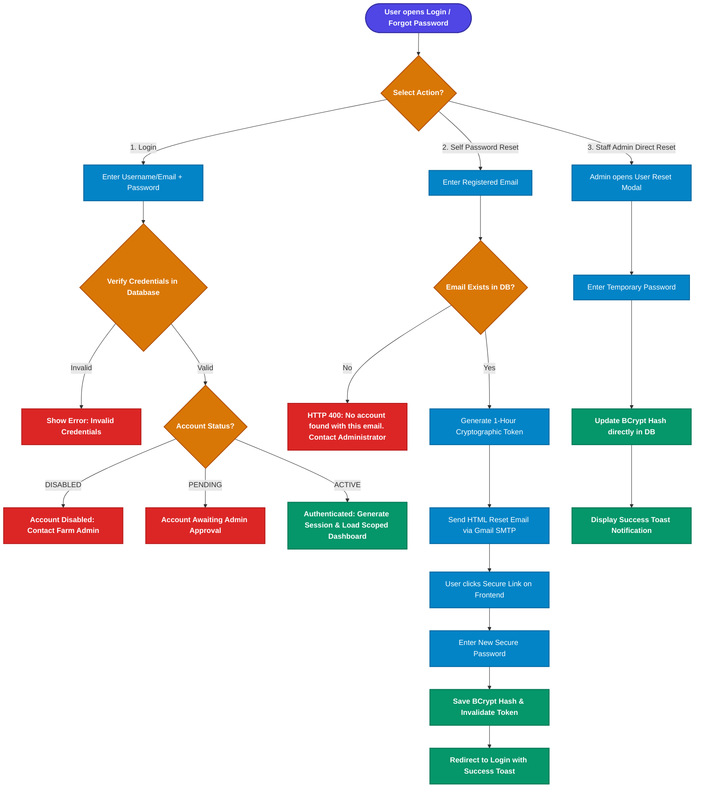
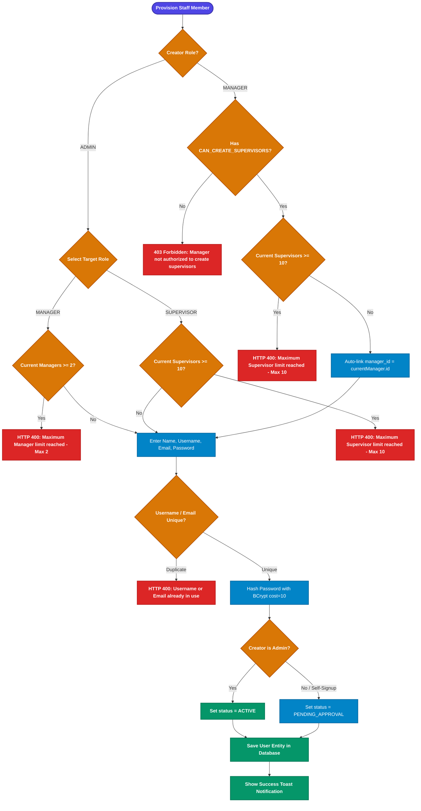
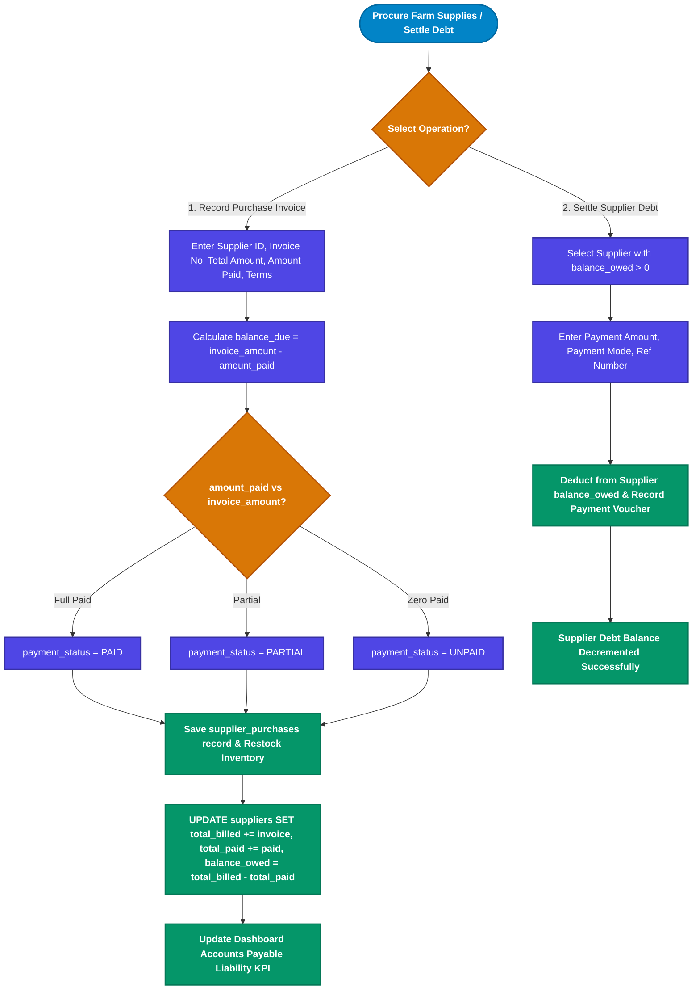
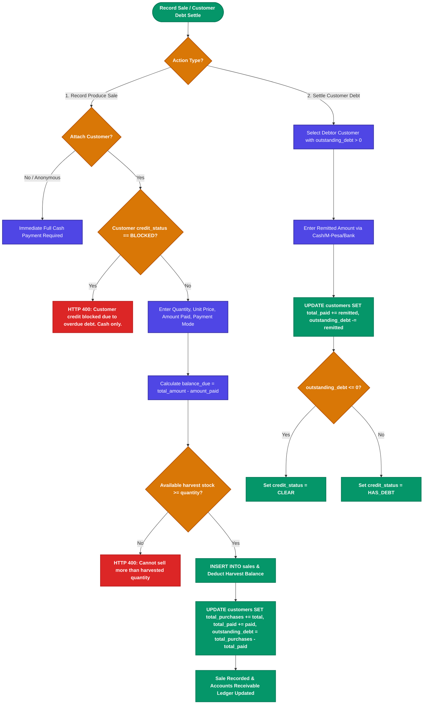
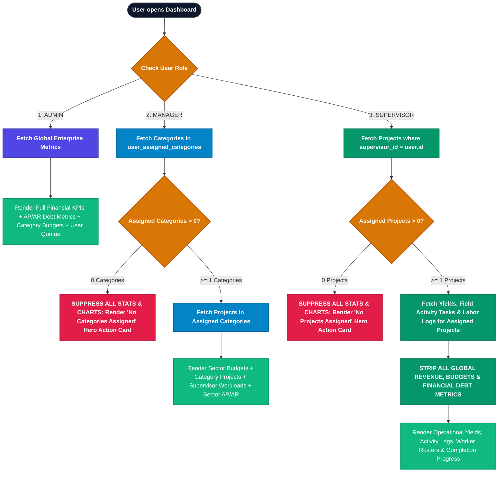

# SmartFarm Complete System Flowcharts Specification

## 1. User Authentication, Login & Multi-Method Password Recovery Flow



---

## 2. Staff Provisioning, Quota Limits & Status Lifecycle Flow



---

## 3. Hierarchical Access Delegation & Capacity Verification Flow

```mermaid
flowchart TD
    classDef adminNode fill:#4f46e5,stroke:#3730a3,stroke-width:2px,color:#ffffff,font-weight:bold;
    classDef managerNode fill:#0284c7,stroke:#0369a1,stroke-width:2px,color:#ffffff,font-weight:bold;
    classDef supervisorNode fill:#059669,stroke:#047857,stroke-width:2px,color:#ffffff,font-weight:bold;
    classDef decisionNode fill:#d97706,stroke:#b45309,stroke-width:2px,color:#ffffff,font-weight:bold;
    classDef errorNode fill:#dc2626,stroke:#b91c1c,stroke-width:2px,color:#ffffff,font-weight:bold;
    classDef successNode fill:#059669,stroke:#047857,stroke-width:2px,color:#ffffff,font-weight:bold;

    subgraph ADMIN_TIER["👑 Farm Administrator Level"]
        AdminAction[Admin selects Manager]:::adminNode --> AssignCats[Assign Farm Categories]:::adminNode
        AssignCats --> SetMgrPrivs[Configure Manager Privileges: Create Categories, Create Supervisors, View Financials, Manage Budgets]:::adminNode
        SetMgrPrivs --> CheckMgrWorkload{Assigned Categories > 3?}:::decisionNode
        CheckMgrWorkload -- Yes --> ShowWorkloadWarn[Display Capacity Warning: Manager has >3 Sectors]:::errorNode
        CheckMgrWorkload -- No --> SaveMgrConfig[Persist Manager Privileges in user_privileges]:::successNode
        ShowWorkloadWarn --> SaveMgrConfig
    end

    subgraph MANAGER_TIER["👔 Farm Manager Level"]
        MgrAction[Manager selects Supervisor]:::managerNode --> AssignProjs[Select Projects in Manager's Categories]:::managerNode
        AssignProjs --> CheckSupCap{Selected Projects > Supervisor Capacity?}:::decisionNode
        CheckSupCap -- Yes --> BlockSupAssign[Block: Selected projects exceed supervisor capacity]:::errorNode
        CheckSupCap -- No --> SetSupPrivs[Configure Supervisor Privileges: Harvest, Activities, Inventory, Petty Expenses, Sales]:::managerNode
        SetSupPrivs --> SaveSupConfig[Save Project Assignments & Privileges in DB]:::successNode
    end
```



---

## 4. Labor Compliance, Legal Adult Verification & Field Task Assignment Flow

```mermaid
flowchart TD
    classDef startNode fill:#4f46e5,stroke:#3730a3,stroke-width:2px,color:#ffffff,font-weight:bold;
    classDef decisionNode fill:#d97706,stroke:#b45309,stroke-width:2px,color:#ffffff,font-weight:bold;
    classDef successNode fill:#059669,stroke:#047857,stroke-width:2px,color:#ffffff,font-weight:bold;
    classDef errorNode fill:#dc2626,stroke:#b91c1c,stroke-width:2px,color:#ffffff,font-weight:bold;
    classDef actionNode fill:#0284c7,stroke:#0369a1,stroke-width:2px,color:#ffffff;

    StartTask([Assign Workers to Field Activity]):::startNode --> CheckAuth{User is Admin, Manager, or Assigned Supervisor?}:::decisionNode
    CheckAuth -- No --> BlockAuth[403 Forbidden: Not authorized to assign labor on this project]:::errorNode
    
    CheckAuth -- Yes --> SelectWorker{Worker registered in Employee Registry?}:::decisionNode
    
    SelectWorker -- No: New Worker --> InputReg[Enter Full Name, Kenyan National ID, Phone Number, Employment Type]:::actionNode
    InputReg --> ValidateID{Valid Kenyan National ID & Adult Age >= 18?}:::decisionNode
    ValidateID -- Invalid / Minor --> RejectMinor[HTTP 400: Valid National ID required. Minors prohibited by labor law.]:::errorNode
    ValidateID -- Valid Adult --> CheckUnique[Check ID uniqueness in DB]:::actionNode
    CheckUnique --> SaveWorker[Save Verified Employee: EMP-xxx with status = ACTIVE]:::successNode
    
    SelectWorker -- Yes: Existing Worker --> CheckActive{Employee status is ACTIVE?}:::decisionNode
    CheckActive -- Inactive --> BlockInactive[HTTP 400: Inactive employee cannot be assigned to tasks]:::errorNode
    CheckActive -- Active --> AddToRoster[Select Employee(s) for Activity]:::actionNode
    SaveWorker --> AddToRoster

    AddToRoster --> InputWorkload[Specify Assignment Date, Hours Worked, Wage Rate, Output Notes]:::actionNode
    AddToRoster --> CalcWages[Calculate Wage Payable = hoursWorked * (dailyRate / 8)]:::actionNode
    CalcWages --> SaveLaborLog[INSERT INTO activity_labor_assignments]:::successNode
    SaveLaborLog --> TaskSuccess[Activity Labor Roster Persisted & Shift Completed]:::successNode
```

---

## 5. Supplier Procurement & Accounts Payable (Debt) Settlement Flow



---

## 6. Customer Credit Governance & Accounts Receivable Settlement Flow



---

## 7. Dynamic Scoped Dashboard & Zero-State Engine Flow


